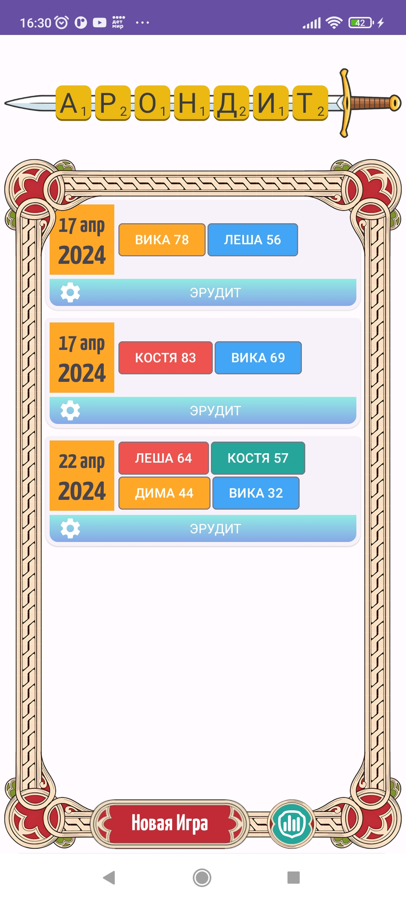
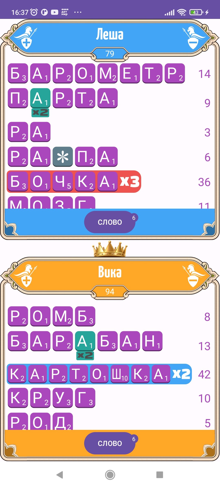
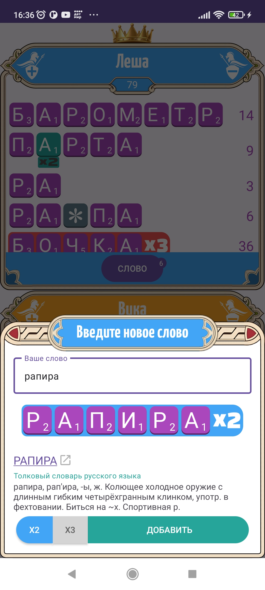
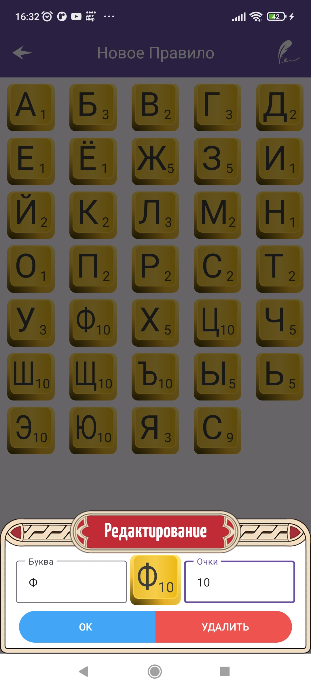
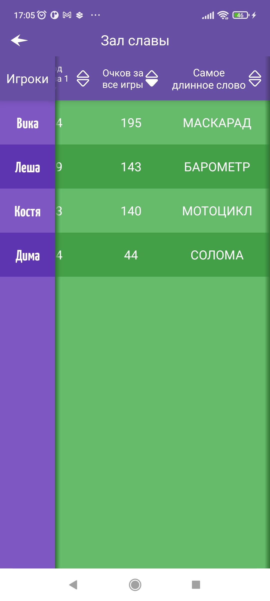

## Арондит

Подсчитывать очки в игре Эрудит бывает довольно утомительно. Для того что бы не тратить время вы
можете использовать "Арондит".
Приложение позволяет вести статистику игры, а так же статистику по всем играм.
Управлять приложением просто:
Вы вводите слово и применяете к нему бонусы, нажимая на соответствующие буквы.
Если слово введено без ошибок и у него есть какое-то словарное определение, то вы увидите его под
словом.

Так же вы можете назначить буквам свои очки, если правила игр Эрудит или Scrabble вам не подходят.

---
***Приложение построено на Чистой архитектуре, разделено на фича-модули, содержит несколько Custom
View***

---
## Youtube превью

## Скриншоты

  
  
  

  
  
  

  
  

